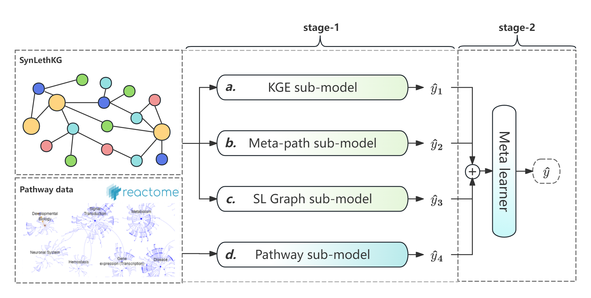

# DSESL: A Deep Stacking Ensemble Model for Synthetic Lethality Prediction



- DSESL is an ensemble model based on a stacking strategy, which is implemented based on PyTorch.
- DSESL need to be trained on two stage.
    - In the first stage(stage-1), DSESL construct four distinct sub-prediction models:
        - the Knowledge Graph Embedding (KGE) sub-model,
        - the meta-path sub-model
        - the SL-graph sub-model
        - the Pathway sub-model
    - In the second stage(stage-2), a meta-learner is trained to integrate the predictions of multiple sub-models from
      the first stage.

# Training

### Step1: Install python packages

```shell
pip install numpy pandas scikit-learn \
    torch_geometric==2.4.0 
```

### Step2: Extract features from `SynLethKG`

- You can download the extracted feature file from [GoogleDrive](https://drive.google.com/drive/folders/1VH6KkdJkYSsIPZF8hKhir1g-lGDALl5D?usp=drive_link)

```log
data_new
├── struct_gnn_relation-cache
│   └── NPC.p
└── type_hop1
    ├── type_feat_Anatomy.p
    ├── type_feat_BiologicalProcess.p
    ├── type_feat_CellularComponent.p
    ├── type_feat_Compound.p
    ├── type_feat_Disease.p
    ├── type_feat_Gene.p
    ├── type_feat_MolecularFunction.p
    ├── type_feat_Pathway.p
    ├── type_feat_PharmacologicClass.p
    ├── type_feat_SideEffect.p
    └── type_feat_Symptom.p

3 directories, 12 files
```

- Alternatively, you can construct these feature files yourself by following these steps
    1. aggregate gene neighbor info
  ```shell
  python -u gnn/type_gnn.py
  ```
    2. calculate and normalize meta-path info of gene-pairs
    ```shell
  chmod ./cache-all-meta-paths.sh
  /bin/bash ./cache-all-meta-paths.sh
  
  # The previous caching script will run in the background, 
  # and after it is completed, execute the following command
  python -u struct_gnn/meta_path.py
  ```

### Step3: Training 4 sub-models in stage-1

- The four sub-models can be trained in parallel
- Here is the command to train four sub-models in the C1 cross validation scenario

```shell
python -u training.py --device cuda:0 \
    --inner_cv_list 1,2,3,4,5 --CV_mode 1 \
    --sub_model_names kge,slg,meta_p,pathway
```

### Step4: Training the meta-learner in stage-2

1. extract sub-models predict results in test fold

```shell
python -u extract_level0_result.py --reload_data \
    --device cuda:0 --inner_cv_list 1,2,3,4,5 --CV_mode 1 \
    --sub_model_names kge,slg,meta_p,pathway --batch_size 1024
```

2. training meta-learner

```shell
python -u training_meta.py --device cuda:0 \
    --inner_cv_list 1,2,3,4,5 --CV_mode 1 \
    --sub_model_names kge,slg,meta_p,pathway --batch_size 1024
```